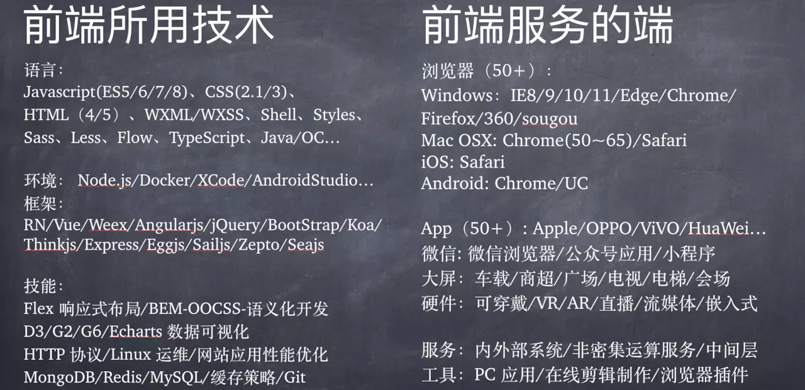
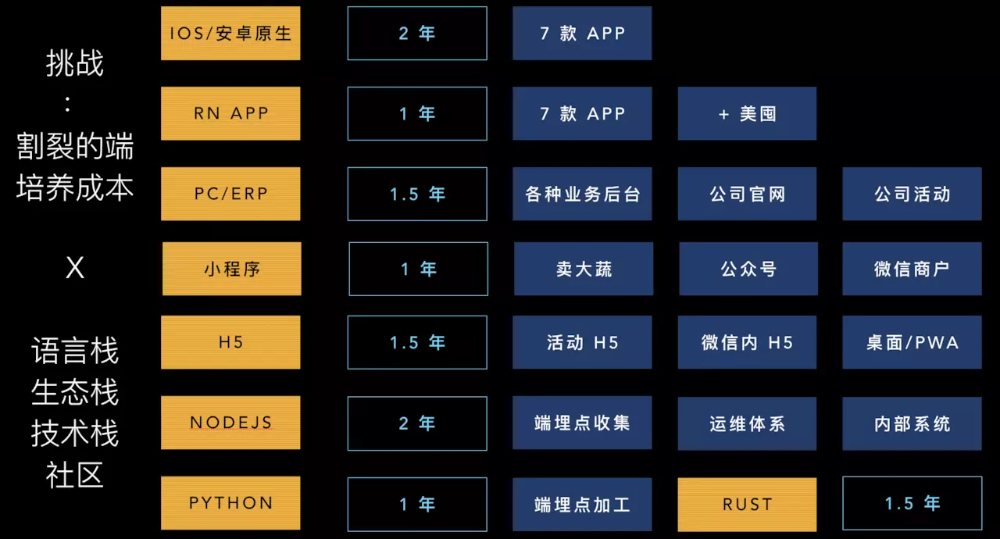
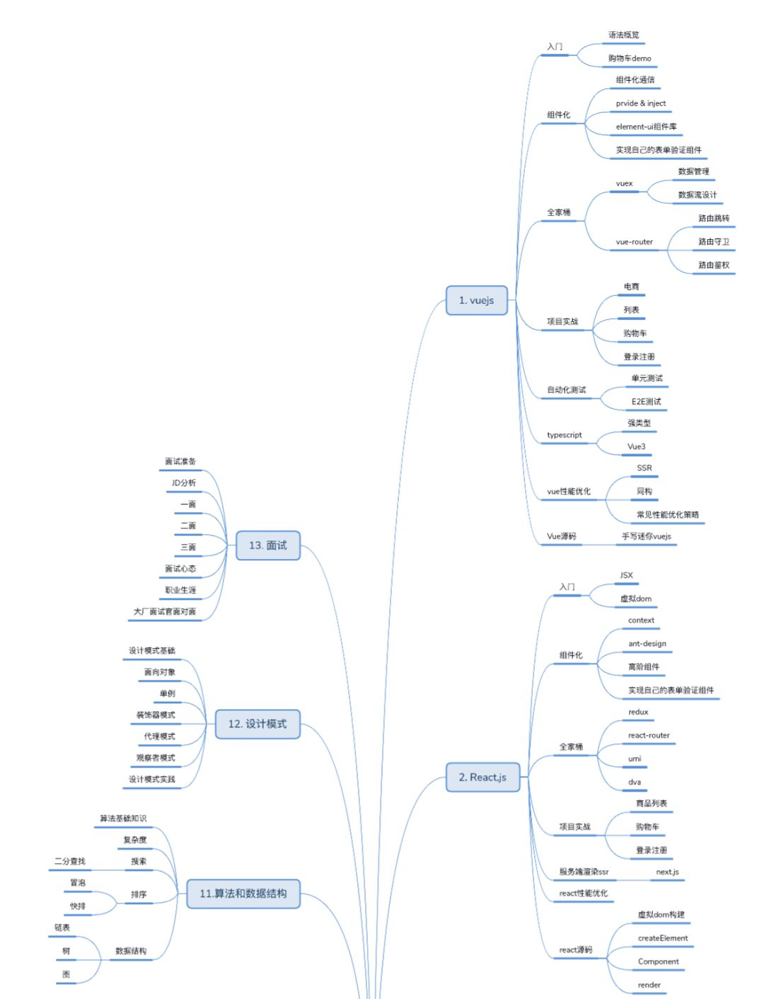
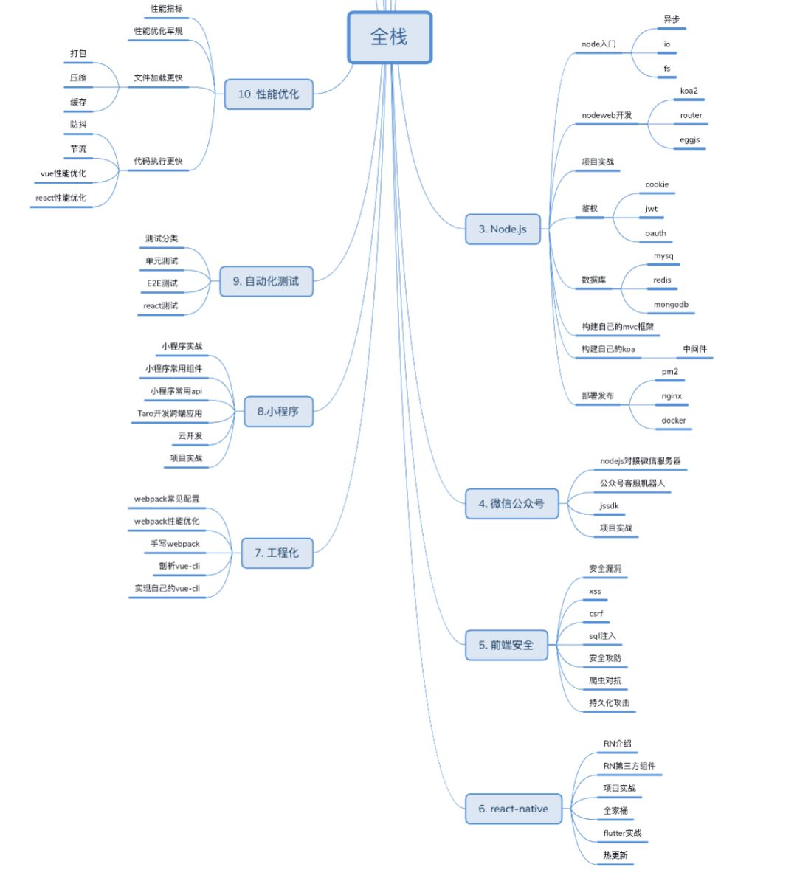
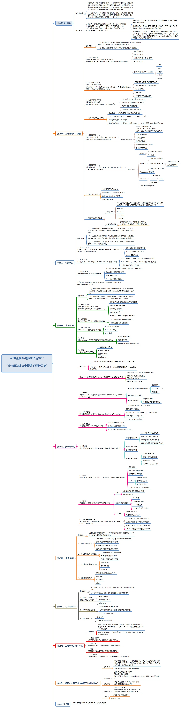

# 前端学习(回去继续：https://www.one-tab.com/page/vr3Wvow3Tm2CGrHeaHRUxQ)

“以前重来不做笔记，这次看到哪里写到哪里，哪天不记得时候，可以当 API 看，当做是管理工具了，重复记忆，这里会尽量保持探索 & 学习 & 更新 知识是用来收集和分享的，本篇只是我收集前端知识的开始，目的是收集最近几年优秀的文章。”

真正解决用户问题的不是前端技术，而是后端的业务逻辑和数据计算，前端并不是计算机的本质，计算机提升社会运作效率并不是靠前端完成的，而是靠自动化来完成的，前端只是辅助。需要走的更好，要么懂设计（UI/UX）设计，另外一个是后端架构技术。

# GitHub 上的顶级项目

顶级项目列表：https://gitstar-ranking.com/repositories

## 教程资源类

1. jlevy/the-art-of-command-line 命令行的基础教程, 有中文翻译
2. justjavac/free-programming-books-zh_CN 免费中文编程书
3. googlesamples/android-architectureGoogle 官方提供的 Android 应用架构例子
4. sindresorhus/awesome-nodejsNodejs 资源, awesome 系列, 不再赘述.
5. toddmotto/public-apis 一些免费的公共 API, 值得收藏.
6. React.js Program【tylermcginnis】https://tylermcginnis.com/courses/ 一个付费网站，如果你不想读取一些是你困惑的文章，就来这里付费看；

## 前端 UI 框架/库

-   `moment/moment` moment.js 是前端处理验证以及显示时间的一个库. 没想到这个功能这么常用啊, 竟然能进 GitHub 前 100.
-   `ElementUI/Element` 饿了么出品的 Vue 组件库
-   `google/material-design-lite` Google 的 Material Design 的一个简化版, 貌似现在不再支持了.
-   `Dogfalo/materialize` Material 风格的前端 CSS 库
-   `callemall/material-ui` Material 风格的 React 组件库
-   `necolas/normalize.css` 我们知道当不使用任何 CSS 的时候, HTML 页面在不同浏览器还是有略微不同的, 这是因为浏览 器自带了一些样式, 而 normalize 的意义就在于把这些样式统一起来. 有人把它比喻成女生化 妆的打底妆过程, 可以说是非常形象生动了~
-   `zurb/foundation-sites` 类似 Bootstrap 的前端 UI 框架, 貌似响应式支持更好一些.

## 大前端框架和库

-   `ionic-team/ionic`
    使用 web 技术来编写移动应用的库. 和 React Native 相比可以说是两条不同的路子吧. Ionic 更加 web 一些.
-   `mrdoob/three.js`
    前端的 3D 库. 可能需要一些基础的图形学知识才能用好.
-   `zeit/next.js`
    基于 React 的一个框架. 前端不是很懂, 不多说了. 关于现在的前端三大框架 React/Vue/Angular 可以阅读前文.
-   `nwjs/nw.js`
    前身是 NodeWebkit, 使用 web 技术来编写跨平台的桌面应用的工具.
-   `apache/incubator-echarts`
    前端的一个显示饼图等示意图的库
-   `gatsbyjs/gatsby`
    Gatsby.js 是一个基于 React 的静态网站生成器
-   `square/retrofit`
    用于 Java 和 Android 的 HTTP 客户端
-   `AFNetworking/AFNetworking`
    用于苹果系列系统的网络库
-   `babel/babel`
    JavaScript 这些年的进化速度非常快, 但是不能保证浏览器升级足够快, 好多过时的浏览器还 有不少市场份额, 但是你又想用新的语法, 这时候就可以使用 babel, 他可以帮你把新版本的 JavaScript 编译到老版本的浏览器支持的语法.
-   `square/okhttp`
    Square 提供的又一个 Java 和 Android 的 HTTP 客户端.
-   `blueimp/jQuery-File-Upload`
    jQuery 的文件上传插件
-   `gulpjs/gulp`
    JS 的构建工具, 有点类似于 C 语言的 make yarnpkg/yarn
-   `Facebook` 出品的 Nodejs 包管理器, 貌似有比官方的 npm 优秀的地方, 不太清楚了.
-   `jashkenas/backbone`
    老牌的前端框架了, 现在用的人应该很少了

## 后端工具

-   `ansible/ansible`
    Ansible 是一个用于部署, 管理多台机器的工具. 和 Puppet 等工具不同的是, Ansible 不需要 再被控机上安装任何 Agent, 只需要能够 SSH 上去就行.
    Ansible 使用 Python 编写.

## 库

-   `google/guava`
    Google 的 Java 核心库, 当想造 Java 的轮子的时候不妨来这里看看是不是已经有了.
    requests/requests
-   `Python` 的第三方 HTTP 客户端, 接口相比标准库的 urllib 友好一些, 不过有内存泄露的严重问 题. 建议生产应用考虑使用 pycurl 比较好, 虽然接口不太友好, 但是特别稳定.

## 语言

-   `iojs/node-v0.x-archive`
    Node.js 老版本的归档, 不再赘述. 请参考 Nodejs

## 通用工具类

-   `typicode/json-server`
    这个其实既是前端工具也是后端工具吧. 根据给定的 json 文件, 提供一个模拟接口. 在后端接 口还没有开发好, 或者需要测试的时候供前端调用, 非常方便.
-   `jykell/jykell`
    jykell 是一个使用 Ruby 编写的静态网站生成器, 也就是说把你的网站预编译成 HTML. 经常用 在 GitHub Pages 上做免费的博客. 不过我个人更喜欢 Pelican.
-   `impress/impress.js`
    又一个基于前端技术来做幻灯片的工具, 不过更加强调 CSS3 的应用, 效果更酷炫一些.
-   `jakubroztocil/httpie`
    命令行调试接口的工具, 相比 curl 来说, 更加直观一点, 对新手友好. 不过我还是喜欢用 curl.
-   [resume](http://resume.github.com)
    利用 GitHub 上的信息生成简历的工具
-   `nvbn/thefuck`
    这个工具很有意思, 当你在命令行敲错命令的时候, 一定会心里默念一句: fuck. 现在你可以直 接再敲一遍 fuck, 他会帮你才出来你刚刚应该输入的正确命令.
-   `NARKOZ/hacker-scripts`
    一个黑客的一些脚本, 比如说如果九点之后还在开发机上登录的话就给老婆发个短信解释一下 ...
-   `rg3/youtube-dl`
    YouTube 视频下载工具
-   `dobe/brackets`
    Adobe 出品的一个代码编辑器, 貌似现在已经不火了吧.
-   `zeit/hyper`
    基于 Electron 做的一个终端模拟器, 不过我现在还在用 iterm2, 有空了体验下.
-   `discourse/discourse`
    一个开源的论坛

## Web 框架

-   `Pallets/flask`
    Flask 是一个 Python 的微框架, 相对 Django 来说上手更简单. 不过我个人用得不多, 感觉业 务的复杂性是不可避免的, 框架并不能解决多少问题.
-   `spring-projects/spring-boot`
    spring 框架相关的东西, 不太熟悉, 有做 Java 的同学欢迎在评论区补充.
-   `django/django`
    老牌的 Python web 框架, 自带了 ORM 和管理界面, 配合 DRF 做后端 Restful API 爽歪歪.

## 架构

-   `kubernetes/kubernetes`
    Kubernetes 经常被缩写成 K8S, 可以毫不犹豫地说, K8S 已经取得了容器编排市场的胜利. 用 Docker 打镜像可以避免装环境的困扰, 同时相对于虚拟机来说, 又不会有很多性能损失. 但 是当 Docker 构成的服务太多的时候, Container 的伸缩, 网络通信等等问题都需要系统性的解 决, 就好比想要多个进程同时运行就需要操作系统来管理一样, 这时候就需要 K8S 来做容器编 排工具了. 有人说, K8S 是云时代的操作系统, 我觉得这个比喻是非常好的.
-   `Google/protobuf`
    使用 RPC 的时候, 可以选择不同序列化工具, ProtoBuffer 可以说是其中的佼佼者了. 支持的 语言多, 序列化性能高, 而且很省空间.

 
已经多样到眼花缭乱，而要挑出来押注的技术方向是需要长期的技术栈过程发展，然后有了第二张图：  

## 前端学习地址和查询地址

-   [各种开发文档大全](https://devdocs.io/)
-   `[开发者手册](https://cloud.tencent.com/developer/devdocs)--腾讯云` 多看
-   [知乎](https://www.zhihu.com/question/327763431/answer/705321309)
-   [WordPress - 百度百科 全球最大中文百科全书](https://wordpress.org/)
-   [语雀](https://www.yuque.com/dashboard/collections)--https://cn.wordpress.org/--http://www.wordpress.org.cn/
-   [前端免费学习网](http://sem.tanzhouedu.com/shiguang/it/web/pc360/?from=360_PC&plan=%E5%89%8D%E7%AB%AF-html%2Fhtml5%2Fcss%E7%B1%BB-QQ%E7%BE%A4&unit=html5&keyword=html5%E5%89%8D%E7%AB%AF%E5%BC%80%E5%8F%91)
-   [segmentfault](https://segmentfault.com/) 学习技能，解决难题
-   [Topics](https://github.com/topics) 浏览 Github 上最常用的主题
-   [GitHub Explore](https://github.com/github/explore)
-   [Mozilla 开发者网络，简称 MDN]()
-   [w3schools.com]()
-   [https://developer.mozilla.org](https://developer.mozilla.org)

## 各类前端资料整理收集

1. [markdown 语法](./markdown/README.md)
    - 【Mermaid plugin for GitBook】[Mermaid plugin for GitBook](https://github.com/JozoVilcek/gitbook-plugin-mermaid)
    - 【mermaid 使用】[mermaid 使用](https://mermaidjs.github.io/)
    - 【Markdown Plus 编辑器】[Markdown Plus 编辑器](https://mdp.tylingsoft.com/)
    - 【使用 Cmd Markdown 编辑阅读器】[使用 Cmd Markdown 编辑阅读](https://www.zybuluo.com/mdeditor)
    - 【表情包】[emoji-cheat-sheet](emoji-cheat-sheet)
2. [基于 html 画流程图](./html5-flow-pic/Web流程图绘制使用raphael.md)

    - [flowchart.js](http://adrai.github.io/flowchart.js/) , 基于 SVG 创建 Flow Chart
    - [go.js](http://www.gojs.net/latest/index.html)go.js 提供一整套的 JS 工具 ，支持各种交互式图表的创建。有免费版和收费版
    - [joint.js](http://www.jointjs.com/) joint.js 是另一个创建图标库的工具，也提供免费版和商业版
    - [jsPlumb](http://www.jsplumb.org/)jsPlumb 是一套开源的流程图创建工具 ，小巧精悍，使用简单
    - [d3](http://d3js.org)在 html5 领域，d3 可谓是最好的可视化基础库，提供方面的 DOM 操作，非常强大。 
    - [dagre](https://github.com/dagrejs/dagre)
    - [dagre-d3](https://github.com/dagrejs/dagre-d3)

    最终，我选择了 jsPlumb，因为它完全开源，使用很简单，用 D3 的话可能会多花很多功夫。joint.js 也不错。大家可以根据自己的需要选择。

3. [canvas 画图及播放视频](./canvas/react中使用canvas播放视频.md)
4. [html5-flow-pic 画流程图](./html5-flow-pic/Web流程图绘制使用raphael.md)
5. [js 基础](./js基础/readme.md)
6. 游戏
7. [babel 笔记](./babel笔记/README.md)
8. [名人博客收集](./名人博客收集/README.md)
9. [动画库收集](./动画库收集/README.md)
10. [架构+脚手架](./架构+脚手架/README.md)
11. [题目](./题目/README.md)
12. Mobx
13. [Redux](./Redux/README.md)
14. [express](./express/readme.md)
15. koa
16. [es6-7-8-9-10](./es6-7-8-9-10/readme.md)
17. [eslint](./eslint/README.md)
18. Webgl
19. [vscode](./vscode/plugins.md)
20. [upload](./upload/README.md)
21. [webpack](./webpack/readme.md)
22. [vue](./vue/readme.md)
23. [WebAssembly]
24. [electronjs](./electronjs/readme.md)桌面应用程序
25. [UI 组件库](./UI组件库/readme.md)

## 推荐的经典的前端书籍

-   [《JavaScript 忍者秘籍》](https://www.amazon.cn/gp/product/B016DWSEWO/ref=as_li_qf_sp_asin_il_tl?ie=UTF8&camp=536&creative=3200&creativeASIN=B016DWSEWO&linkCode=as2&tag=yanhaijing-23)
-   [《JavaScript 高级程序设计》](https://www.amazon.cn/gp/product/B007OQQVMY/ref=as_li_qf_sp_asin_il_tl?ie=UTF8&camp=536&creative=3200&creativeASIN=B007OQQVMY&linkCode=as2&tag=vastwork-23)
-   [《编写可维护的 JavaScript》](https://www.amazon.cn/gp/product/B00BQ7RMW0/ref=as_li_qf_sp_asin_il_tl?ie=UTF8&camp=536&creative=3200&creativeASIN=B00BQ7RMW0&linkCode=as2&tag=vastwork-23)
-   [《Javascript 语言精粹》](https://www.amazon.cn/gp/product/B0097CON2S/ref=as_li_qf_sp_asin_il_tl?ie=UTF8&camp=536&creative=3200&creativeASIN=B0097CON2S&linkCode=as2&tag=vastwork-23)
-   [《锋利的 jQuery》](https://www.amazon.cn/gp/product/B0089TDFNS/ref=as_li_qf_sp_asin_il_tl?ie=UTF8&camp=536&creative=3200&creativeASIN=B0089TDFNS&linkCode=as2&tag=vastwork-23)
-   [《JavaScript DOM 编程艺术（第二版）》](https://www.amazon.cn/gp/product/B004VJM5KE/ref=as_li_qf_sp_asin_il_tl?ie=UTF8&camp=536&creative=3200&creativeASIN=B004VJM5KE&linkCode=as2&tag=vastwork-23)
-   [《学习 JavaScript 数据结构与算法》](https://www.amazon.cn/gp/product/B016DWSF8M/ref=as_li_qf_sp_asin_il_tl?ie=UTF8&camp=536&creative=3200&creativeASIN=B016DWSF8M&linkCode=as2&tag=vastwork-23)
-   [《JavaScript 权威指南》](https://www.amazon.cn/gp/product/B007VISQ1Y/ref=as_li_qf_sp_asin_il_tl?ie=UTF8&camp=536&creative=3200&creativeASIN=B007VISQ1Y&linkCode=as2&tag=vastwork-23)
-   [《JavaScript 忍者秘籍》](https://www.amazon.cn/gp/product/B016DWSEWO/ref=as_li_qf_sp_asin_il_tl?ie=UTF8&camp=536&creative=3200&creativeASIN=B016DWSEWO&linkCode=as2&tag=vastwork-23)
-   [《高性能 JavaScript》](https://www.amazon.cn/gp/product/B013SGB2AO/ref=as_li_qf_sp_asin_il_tl?ie=UTF8&camp=536&creative=3200&creativeASIN=B013SGB2AO&linkCode=as2&tag=vastwork-23)
-   [《ECMAScript 6 标准入门》](https://www.amazon.cn/gp/product/B01A18WWAG/ref=as_li_qf_sp_asin_il_tl?ie=UTF8&camp=536&creative=3200&creativeASIN=B01A18WWAG&linkCode=as2&tag=vastwork-23)
-   [《Build Your Own AngularJS》](http://teropa.info/build-your-own-angular/)
-   [《Effective JavaScript:编写高质量 JavaScript 代码的 68 个有效方法》](https://www.amazon.cn/gp/product/B00GMXI1QY/ref=as_li_qf_sp_asin_il_tl?ie=UTF8&camp=536&creative=3200&creativeASIN=B00GMXI1QY&linkCode=as2&tag=vastwork-23)
-   [《你不知道的 JavaScript（上）》](https://www.amazon.cn/gp/product/B00W34DZ8K/ref=as_li_qf_sp_asin_il_tl?ie=UTF8&camp=536&creative=3200&creativeASIN=B00W34DZ8K&linkCode=as2&tag=vastwork-23)
-   [《单页 Web 应用：JavaScript 从前端到后端》](https://www.amazon.cn/gp/product/B00NN8GJGA/ref=as_li_qf_sp_asin_il_tl?ie=UTF8&camp=536&creative=3200&creativeASIN=B00NN8GJGA&linkCode=as2&tag=vastwork-23)
-   [《HTML5 与 CSS3 基础教程（第八版）》](https://www.amazon.cn/gp/product/B015316ZWC/ref=as_li_qf_sp_asin_il_tl?ie=UTF8&camp=536&creative=3200&creativeASIN=B015316ZWC&linkCode=as2&tag=vastwork-23)
-   [《深入浅出 HTML 与 CSS》](https://www.amazon.cn/gp/product/B00IT1WM4Y/ref=as_li_qf_sp_asin_il_tl?ie=UTF8&camp=536&creative=3200&creativeASIN=B00IT1WM4Y&linkCode=as2&tag=vastwork-23)
-   [《CSS 揭秘》](https://www.amazon.cn/gp/product/B01ET3FO86/ref=as_li_qf_sp_asin_il_tl?ie=UTF8&camp=536&creative=3200&creativeASIN=B01ET3FO86&linkCode=as2&tag=vastwork-23)
-   [《HTML5 权威指南》](https://www.amazon.cn/gp/product/B00H706BIG/ref=as_li_qf_sp_asin_il_tl?ie=UTF8&camp=536&creative=3200&creativeASIN=B00H706BIG&linkCode=as2&tag=vastwork-23)
-   [《CSS 权威指南》](https://www.amazon.cn/CSS%E6%9D%83%E5%A8%81%E6%8C%87%E5%8D%97-%E8%BF%88%E8%80%B6/dp/B0011F5SIC?ie=UTF8&creative=2384&creativeASIN=B0011F5SIC&linkCode=df0&ref_=asc_df_B0011F5SIC2184243&tag=vaskwork-23)
-   [《精通正则表达式》](https://www.amazon.cn/gp/product/B008UCHA58/ref=as_li_qf_sp_asin_il_tl?ie=UTF8&camp=536&creative=3200&creativeASIN=B008UCHA58&linkCode=as2&tag=vastwork-23)
-   [深入理解 JavaScript 特性]()
-   [Java Web 应用开发]()

