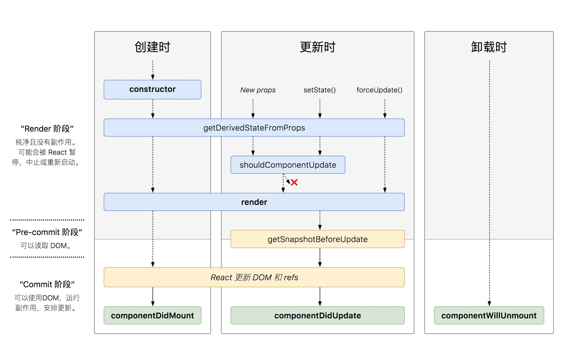
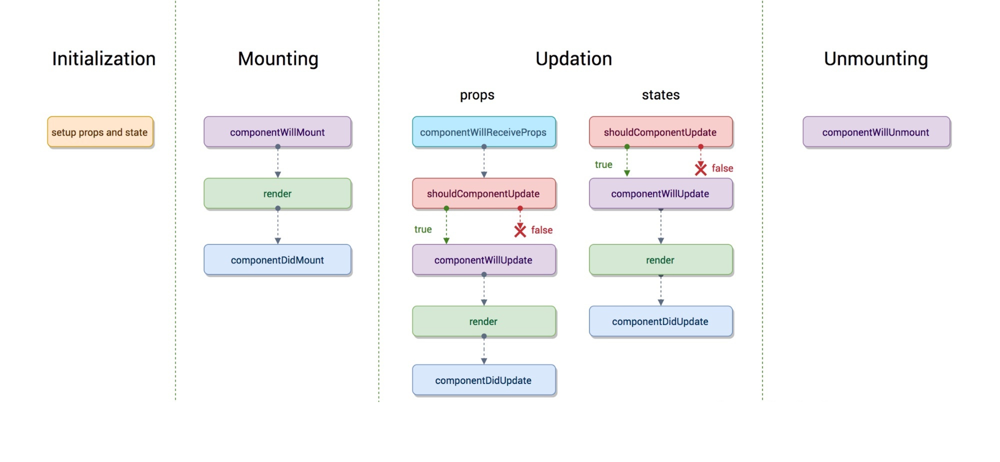
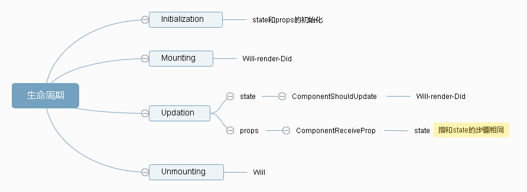

# [周期函数](https://zh-hans.reactjs.org/docs/react-component.html#static-getderivedstatefromprops)

> v16

1. 生命周期函数的更新
2. createContext
3. createRef
4. forwardRef
5. strict Mode

> 在原有基础上新增

1. getDerivedStateFromProps
2. getSnapshotBeforeUpdate
3. getDerivedStateFromError
4. componentDidCatch

> 建议不在使用

1. componentWillMount
2. componentWillUpdate
3. componentWillReceiveProps<br>
   =>
    > 同时调整为，用到 react17 就停止
4. UNSAFE_componentWillMount()
5. UNSAFE_componentWillUpdate(nextProps, nextState)
6. UNSAFE_componentWillReceiveProps(nextProps)

> 16.4 之后的最新的周期函数



-   `static getDerivedStateFromProps(props, state)`,会在调用 render 方法之前调用，并且在初始挂载及后续更新时都会被调用。它应返回一个对象来更新 state，如果返回 null 则不更新任何内容。<br>

    ```javascript react
    class Example extends Component {
        state = {
            filterText: ""
        };

        // *******************************************************
        // 注意：这个例子不是建议的方法。
        // 下面的例子才是建议的方法。
        // *******************************************************

        static getDerivedStateFromProps(props, state) {
            // 列表变化或者过滤文本变化时都重新过滤。
            // 注意我们要存储 prevFilterText 和 prevPropsList 来检测变化。
            if (
                props.list !== state.prevPropsList ||
                state.prevFilterText !== state.filterText
            ) {
                return {
                    prevPropsList: props.list,
                    prevFilterText: state.filterText,
                    filteredList: props.list.filter(item =>
                        item.text.includes(state.filterText)
                    )
                };
            }
            return null;
        }

        handleChange = event => {
            this.setState({ filterText: event.target.value });
        };

        render() {
            return (
                <Fragment>
                    <input
                        onChange={this.handleChange}
                        value={this.state.filterText}
                    />
                    <ul>
                        {this.state.filteredList.map(item => (
                            <li key={item.id}>{item.text}</li>
                        ))}
                    </ul>
                </Fragment>
            );
        }
    }
    ```

    这个实现避免了重复计算 filteredList，但是过于复杂。因为它必须单独追踪并检测 prop 和 state 的变化，在能及时的更新过滤后的 list。我们可以使用 PureComponent，把过滤操作放到 render 方法里来简化这个组件：

    ```javascript react
    // PureComponents 只会在 state 或者 prop 的值修改时才会再次渲染。
    // 通过对 state 和 prop 的 key 做浅比较（ shallow comparison ）来确定有没有变化。
    class Example extends PureComponent {
        // state 只需要保存 filter 的值：
        state = {
            filterText: ""
        };

        handleChange = event => {
            this.setState({ filterText: event.target.value });
        };

        render() {
            // PureComponent 的 render 只有
            // 在 props.list 或 state.filterText 变化时才会调用
            const filteredList = this.props.list.filter(item =>
                item.text.includes(this.state.filterText)
            );

            return (
                <Fragment>
                    <input
                        onChange={this.handleChange}
                        value={this.state.filterText}
                    />
                    <ul>
                        {filteredList.map(item => (
                            <li key={item.id}>{item.text}</li>
                        ))}
                    </ul>
                </Fragment>
            );
        }
    }
    ```

    上面的方法比派生 state 版本更加清晰明了。只有在过滤很大的列表时，这样做的效率不是很好。当有 prop 改变时 PureComponent 不会阻止再次渲染。为了解决这两个问题，我们可以添加 memoization 帮助函数来阻止非必要的过滤：

    ```javascript react
    import memoize from "memoize-one";

    class Example extends Component {
        // state 只需要保存当前的 filter 值：
        state = { filterText: "" };

        // 在 list 或者 filter 变化时，重新运行 filter：
        filter = memoize((list, filterText) =>
            list.filter(item => item.text.includes(filterText))
        );

        handleChange = event => {
            this.setState({ filterText: event.target.value });
        };

        render() {
            // 计算最新的过滤后的 list。
            // 如果和上次 render 参数一样，`memoize-one` 会重复使用上一次的值。
            const filteredList = this.filter(
                this.props.list,
                this.state.filterText
            );

            return (
                <Fragment>
                    <input
                        onChange={this.handleChange}
                        value={this.state.filterText}
                    />
                    <ul>
                        {filteredList.map(item => (
                            <li key={item.id}>{item.text}</li>
                        ))}
                    </ul>
                </Fragment>
            );
        }
    }
    ```

    这样更简单，而且和派生 state 版本一样好！

    在使用 memoization 时，请记住这些约束：

    1.  大部分情况下， 每个组件内部都要引入 memoized 方法，已免实例之间相互影响。
    2.  一般情况下，我们会限制 memoization 帮助函数的缓存空间，以免内存泄漏。（上面的例子中，使用 memoize-one 只缓存最后一次的参数和结果）。
    3.  如果每次父组件都传入新的 props.list ，那本文提到的问题都不会遇到。在大多数情况下，这种方式是可取的。

    <b style="color:red">请注意，不管原因是什么，都会在每次渲染前触发此方法。这与 UNSAFE_componentWillReceiveProps 形成对比，后者仅在父组件重新渲染时触发，而不是在内部调用 setState 时。</b>

-   `getSnapshotBeforeUpdate(prevProps, prevState)`,在最近一次渲染输出（提交到 DOM 节点）之前调用。它使得组件能在发生更改之前从 DOM 中捕获一些信息（例如，滚动位置）。此生命周期的任何返回值将作为参数传递给 `componentDidUpdate()`。

    ```javascript react
    class ScrollingList extends React.Component {
        constructor(props) {
            super(props);
            this.listRef = React.createRef();
        }

        getSnapshotBeforeUpdate(prevProps, prevState) {
            // 我们是否在 list 中添加新的 items ？
            // 捕获滚动​​位置以便我们稍后调整滚动位置。
            if (prevProps.list.length < this.props.list.length) {
                const list = this.listRef.current;
                return list.scrollHeight - list.scrollTop;
            }
            return null;
        }

        componentDidUpdate(prevProps, prevState, snapshot) {
            // 如果我们 snapshot 有值，说明我们刚刚添加了新的 items，
            // 调整滚动位置使得这些新 items 不会将旧的 items 推出视图。
            //（这里的 snapshot 是 getSnapshotBeforeUpdate 的返回值）
            if (snapshot !== null) {
                const list = this.listRef.current;
                list.scrollTop = list.scrollHeight - snapshot;
            }
        }

        render() {
            return <div ref={this.listRef}>{/* ...contents... */}</div>;
        }
    }
    ```

> 工作的流程





## 生命周期函数的调用时期

-   Initialization

    -   执行`Constructor`，初始`state`和`props`

-   `Mounting`组件创建并添加到 DOM 中

    -   `Will`：先执行，判断组件是否挂载
    -   `render`：渲染组件
    -   `Did`：组件渲染完成后执行
        1. constructor
        2. static getDerivedStateFromProps(props, state)
        3. render
        4. conponentDidMount

-   `Updation`props 或 state 的改变触发了组件重新渲染

    -   `ComponentWillReceiveProps`：如果组件不是第一次存在页面且父组件 render 执行时，才执行
    -   `ComponentShouldUpdate`：判断组件是否需要更新，如果返回 true，表示需要更新；如果返回 false，则表示不需要更新
    -   `Will`：更新组件前执行
    -   `render`：state 发生变化，或者父组件的 render（props 发生变化）执行时执行
    -   `Did`：组件更新完成后执行
        1. static getDerivedStateFromProps(props, state)
        2. shouldComponentUpdate(nextProps, nextState)
        3. render
        4. getSnapshotBeforeUpdate(prevProps, prevState)
        5. componentDidUpdate

-   `UnMounting`组件解绑时触发

    -   `Will`：组件移除之前执行
        1. componentWillUnmount

-   `Error Handling`在组件渲染、生命周期或子组件的构造函数里出现错误时触发

    1.  static getDerivedStateFromError(error)

    ```javascript
    class ErrorBoundary extends React.Component {
        constructor(props) {
            super(props);
            this.state = { hasError: false };
        }

        static getDerivedStateFromError(error) {
            // 更新 state 使下一次渲染可以显降级 UI
            return { hasError: true };
        }

        render() {
            if (this.state.hasError) {
                // 你可以渲染任何自定义的降级  UI
                return <h1>Something went wrong.</h1>;
            }

            return this.props.children;
        }
    }
    ```

    <b style="color:#e36988;">
        注意:<br/>
        1. 如果移除组件，那么 Updation 中的生命周期函数不会被执行<br>
        2. render 不能省略，因为 render 不存在 Component 中，不能继承而来，需要自定义<br>
        3. getDerivedStateFromError() 会在渲染阶段调用，因此不允许出现副作用。 如遇此类情况，请改用 `componentDidCatch(error, info)`。</b>

    ```javascript react
    class ErrorBoundary extends React.Component {
        constructor(props) {
            super(props);
            this.state = { hasError: false };
        }

        static getDerivedStateFromError(error) {
            // 更新 state 使下一次渲染可以显示降级 UI
            return { hasError: true };
        }

        componentDidCatch(error, info) {
            // "组件堆栈" 例子:
            //   in ComponentThatThrows (created by App)
            //   in ErrorBoundary (created by App)
            //   in div (created by App)
            //   in App
            logComponentStackToMyService(info.componentStack);
        }

        render() {
            if (this.state.hasError) {
                // 你可以渲染任何自定义的降级 UI
                return <h1>Something went wrong.</h1>;
            }

            return this.props.children;
        }
    }
    ```

    <b style="color:#e36988;">
    注意:<br/>
    如果发生错误，你可以通过调用 setState 使用 componentDidCatch() 渲染降级 UI，但在未来的版本中将不推荐这样做。 可以使用静态 getDerivedStateFromError() 来处理降级渲染。</b>

## 生命周期函数的使用场景

-   避免子组件不必要的更新
    我们知道如果父组件的 render 执行，子组件的 render 会被执行，重新渲染子组件。但是，父组件 render 的执行不一定是该子组件绑定的数据改变造成的，这就造成了子组件不必要的更新。

    解决方法：

    ```javascript react
      // 在子组件中
      ComponentRecevieProps(nextProps, nextState){
      // content是props中的一个属性
      return nextProps.content !== this.props.content
      }
    ```

-   发送 ajax 请求

    ajax 请求最好放在 ComponentDidMount 中

    ```javascript react
    componentDidMount(){
      // 这里使用了axios模块
      axios.get('/api/todolist')
      .then(() => {alert('success')})
      .catch(() => {alert('error')})
    }
    ```

# HOOKS

> [hook-flow](https://github.com/donavon/hook-flow)


参考文档：

[React Lifecycle](https://github.com/sammffl/blog/issues/1)

[你可能不需要使用派生 state](https://zh-hans.reactjs.org/blog/2018/06/07/you-probably-dont-need-derived-state.html#when-to-use-derived-state)
