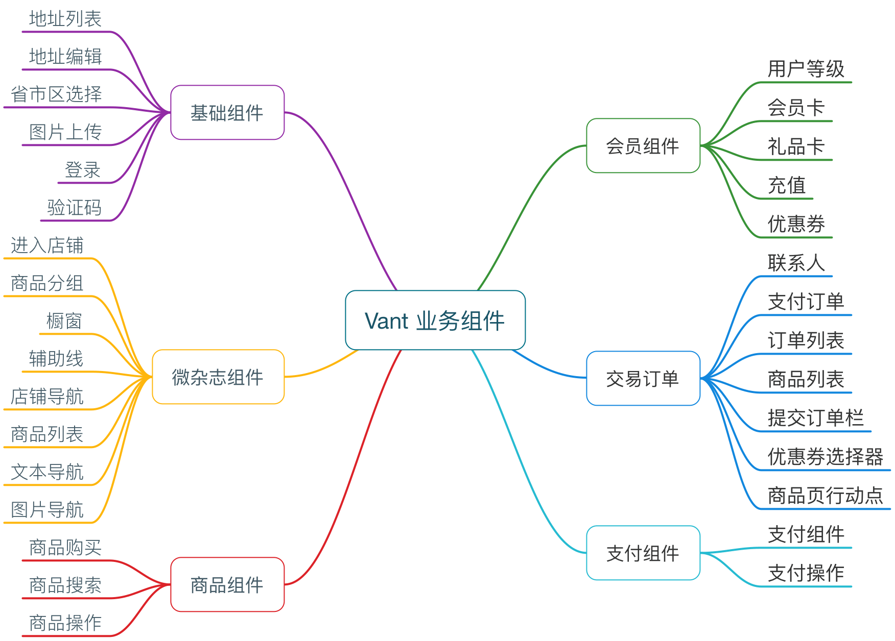

# UI 组件库收集

-   [element-ui](https://element.eleme.cn/#/zh-CN) 网站快速成型工具 https://element.eleme.io/#/zh-CN

    仓库地址： https://github.com/ElemeFE/element
    文档地址： http://element.eleme.io/#/

    Element，一套为开发者、设计师和产品经理准备的基于 Vue 2.0 的桌面端组件库

    Element UI 是一套采用 Vue 2.0 作为基础框架实现的组件库，它面向企业级的后台应用，能够帮助你快速地搭建网站，极大地减少研发的人力与时间成本。在这个月的 NingJS 上我们开源了这个项目，当时它的文档还没有准备好。今天，经过两周多的完善， Element UI 的文档正式上线啦！目前它处于 rc 阶段，正式版将于 Vue 2.0 发布后第一时间跟进。 欢迎大家来使用和完善，一起把它做成 Vue 最好的企业级组件库。

-   [Bootstrap](https://getbootstrap.com/) 中文：https://www.bootcss.com/

    简洁、直观、强悍的前端开发框架，让 web 开发更迅速、简单。

-   [Vant](https://youzan.github.io/vant/#/zh-CN/intro) 轻量、可靠的移动端 Vue 组件库,高效的 Vue 组件库，再造一个有赞移动商城也不在话下。
    
-   
