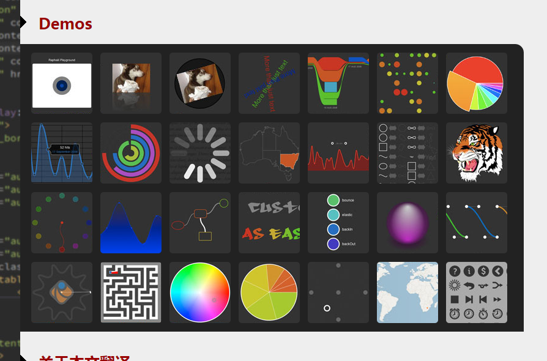
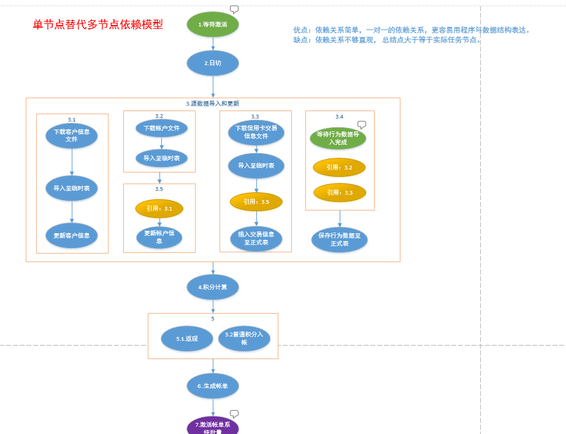

# Web流程图绘制使用raphael

摘要：本文要实现一个流程图的绘制，最终的目标是实现流程图的自动绘制，并可进行操作，直接点击流程图上对应的方框就可以让后台跑相应的程序

## 一、插件介绍
>1、图形绘制[raphael](https://dmitrybaranovskiy.github.io/raphael/)

其中图形绘制使用了raphael，下载地址：http://raphaeljs.com，它的功能非常强大。

中文帮助教程：http://html5css3webapp.com/raphaelApi.htm#Paper.text

其中有一些DEMO如下：

Web流程图绘制使用raphael

>2、鼠标右键菜单栏弹出smartMenu

教程及下载地址：[【jQuery】smartMenu右键自定义上下文菜单插件(似web QQ)](http://justcode.ikeepstudying.com/2015/09/【jquery】smartmenu右键自定义上下文菜单插件似web-qq/)

>3、字体大小变化利器插件jquery.fontFlex

随着页面的放大或者缩小，字体也跟随着放大或者缩小。当然，可以设置一个最大值，一个中间值和一个最小值。此效果多半应用于响应式页面中，或者需要适用多版本终端浏览器的页面中

## 使用
>1、首先，来看看要实现的流程图的样子。

>2、代码实现