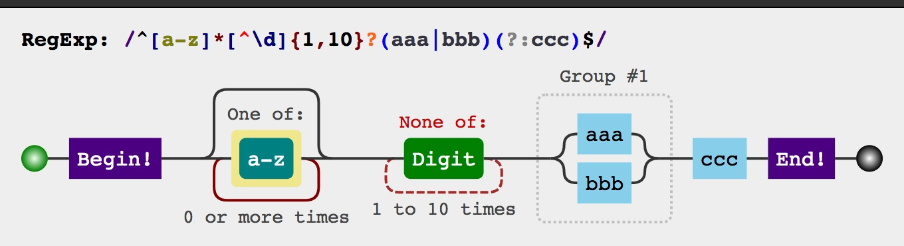
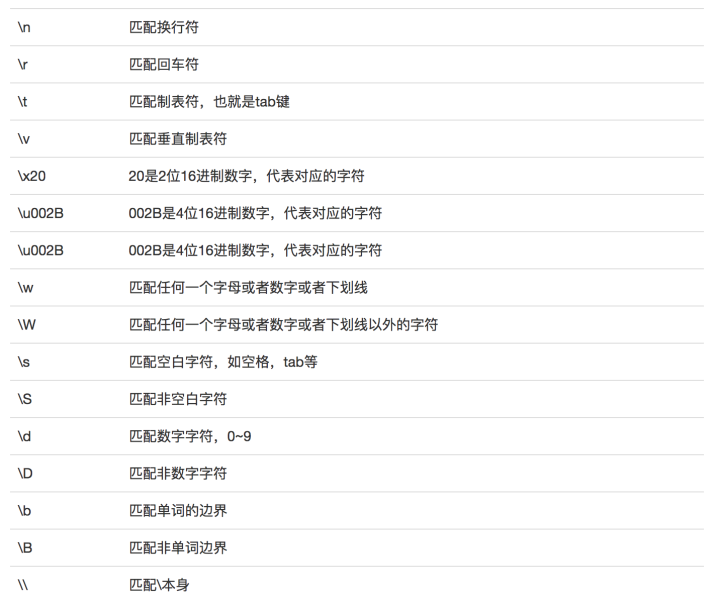

# 正则表达式

图形化展示的[工具](<https://jex.im/regulex/#!flags=&re=%5E(a%7Cb)*%3F%24>)，我们把涉及到的语法罗列一下

/^[a-z]\*[^\d]{1,10}?(aaa|bbb)(?:ccc)\$/

推荐一下[glob](https://github.com/isaacs/node-glob)，号称给人看的正则，比正则的语法简单多了，也是平时开发的神器.

-   简单字符
    -   /abc/ // 匹配 abc
    -   /123/ // 匹配 123
    -   /-_-/ // 匹配 -_-
    -   /海镜/ // 匹配 海镜
-   转义字符

    \是转移字符，其后面的字符会代表不同的意思，转移字符主要有三个作用：

    第一种，是为了匹配不方便显示的特殊字符，比如换行，tab 符号等

    第二种，正则中预先定义了一些代表特殊意义的字符，比如\w 等

    第三种，在正则中某些字符有特殊含义(比如下面说到的)，转义字符可以让其显示自身的含义

    下面是常用转义字符列表：
    

-   字符集和
    -   [abc]能够匹配 a 或 b 或 c
    -   [0123456789]
    -   [0-9]
    -   [^abc]在前面添加^，可表示非的意思，下面的代码能够匹配 abc 之外的任意字符
    -   [^\n]. 匹配除了换行符（\n）以外的任意一个字符
    -   \w = [0-9a-Z_]
    -   \W = [^0-9a-z_]
    -   \s = [ \t\n\v]
    -   \S = [^ \t\n\v]
    -   \d = [0-9]
    -   \D = [^0-9]
-   量词

    -   `{n}`匹配 n 次，比如 a{2}，匹配 aa
    -   `{m, n}`匹配 m-n 次，优先匹配 n 次，比如 a{1,3}，可以匹配 aaa、aa、a
    -   `?`匹配 0 次或 1 次，优先匹配 1 次，相当于{0,1}
    -   `+`匹配 1-n 次，优先匹配 n 次，相当于{1,}
    -   `\*`匹配 0-n 次，优先匹配 n 次，相当于{0,}
    -   正则默认和人心一样是贪婪的，也就是常说的贪婪模式，凡是表示范围的量词，都优先匹配上限而不是下限
    -   a{1, 3} // 匹配字符串'aaa'的话，会匹配 aaa 而不是 a
    -   a{1, 3}? // 匹配字符串'aaa'的话，会匹配 a 而不是 aaa

-   字符边界

    有时我们会有边界的匹配要求，比如已 xxx 开头，已 xxx 结尾

    ^在[]外表示匹配开头的意思,\$表示匹配结尾的意思,上面提到的\b 表示单词的边界

    -   ^abc // 可以匹配 abc，但是不能匹配 aabc
    -   abc\$ // 可以匹配 abc，但是不能匹配 abcc
    -   abc\b // 可以匹配 abc ，但是不能匹配 abcc

-   选择表达式

    正则中用|来表示分组，a|b 表示匹配 a 或者 b 的意思

    -   123|456|789 // 匹配 123 或 456 或 789

-   分组与引用
    `分组`是正则中非常强大的一个功能，可以让上面提到的量词作用于一组字符，而非单个字符，分组的语法是`圆括号`包裹(xxx),分组不能放在`[]`中，分组中还可以使用选择表达式,和分组相关的概念还有一个`捕获分组`和`非捕获分组`，分组默认都是捕获的，在分组的(后面添加?:可以让分组变为`非捕获分组`，`非捕获分组`可以提高性能和简化逻辑

    -   (abc){2} // 匹配 abcabc
    -   (123|456){2} // 匹配 123123、456456、123456、456123
    -   '123'.match(/(123)/) // 返回 ['123', '123']
    -   '123'.match(/(?123)/) // 返回 ['123']

    `引用`的语法是\数字，数字代表引用前面第几个捕获分组，注意非捕获分组不能被引用

    -   <([a-z]+)><\/\1> // 可以匹配 `` 或 `

`等

-   预搜索

    如果你想匹配 xxx 前不能是 yyy，或者 xxx 后不能是 yyy，那就要用到预搜索

    js 只支持先行预搜索，也就是 xxx 前面必须是 yyy，或者 xxx 前面不能是 yyy

    -   (?!1)2 // 可有匹配 22，不能匹配 12
    -   (?=1)2 // 可以匹配 12，不能匹配 22

-   修饰符

    默认正则是区分大小写，这可能并不是我们想要的，正则提供了修饰符的功能，修复的语法如下:

    g 正则遇到第一个匹配的字符就会结束，加上全局修复符，可以让其匹配到结束

    i 正则默认是区分大小写的，i 可以忽略大小写

    m 正则默认遇到换行符就结束了，不能匹配多行文本，m 可以让其匹配多行文本

    -   /xxx/gim // 最后面的 g 和 i 就是两个修饰符----new RegExp(/cccc/gi).test('cCcc')
