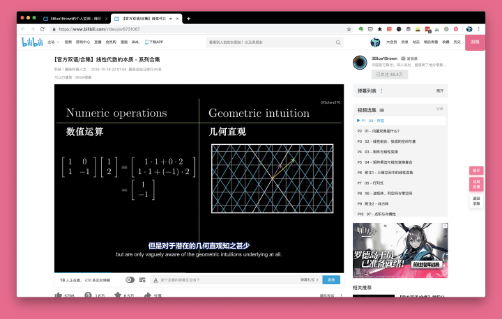
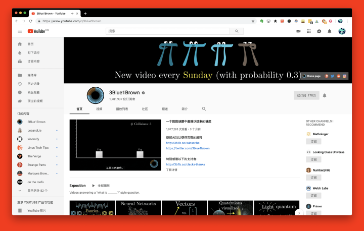
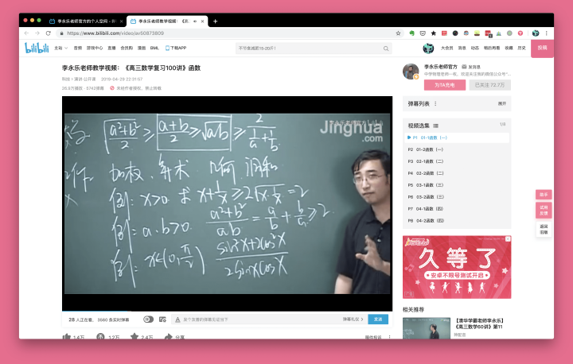

# 关注这些牛人，你可以丰富多彩

>3Blue1Brown

对不少理工科学生来说，数学都是噩梦一般的存在。从线代到离散，从高数到数分，每一科都要耗费大量的时间和精力，让人想怒摔课本。为了人类的未来发展，[3Blue1Brown](https://space.bilibili.com/88461692) 决心用动画讲述数学专业知识，其视频涵盖了线性代数、微积分、拓扑学等领域，每门课都配有直观生动的动画演示，帮助观众加深对数学概念定理的理解。

3Blue1Brown 原作者毕业于斯坦福大学数学系，并在 Khan Academy 担任过数学讲师，专业性有所保障。如果你上网方式比较科学，也可以关注其 [YouTube](https://www.youtube.com/c/3blue1brown) 账号，第一时间掌握其动态。

>李永乐老师官方

如果你还是高中生，不妨关注[李永乐老师官方](https://space.bilibili.com/9458053)这个 B 站账号。他任职于人大附中，取得了北京大学双学士学位，在物理和数学两大学科领域都颇有造诣。除了高中数学讲座外，他还会结合时事热点，推出《流浪地球》科普、金庸武侠的科学解释等视频，幽默风趣，寓教于乐。

>田浅浅

[田浅浅](https://space.bilibili.com/8695736)是一位人大本科生，高考排名全省前百，她的学习经验对文科生来说大有裨益。在她的个人投稿中，你可以找到文综答题技巧、练字方法、高效笔记术、期末复习技巧等，凝聚了一枚学霸的心血。

>蜡笔和小勋

[蜡笔和小勋](https://space.bilibili.com/250111460) 是一对浙大毕业的情侣，他俩上传的视频，除了狂撒狗粮外，就是自己学习的经验之谈了，例如提高记忆效率、自律和自制力、对付拖延症等。如果你想提高自己的成绩排名，看他们的视频准没错。

>潘子Jane

[潘子Jane](https://space.bilibili.com/14264313) 是一位清华大学在读研究生，她的 B 站账号为我们分享了诸多生活技巧和个人感悟，如学生党如何月入过万、快速背单词方法、考研历程分享等，都是过来人的经验之谈。此外，你也可以借她的视频窥见清华学生的日常生活，激励自己进取前行。

>FanfaniShare

[FanfaniShare](https://space.bilibili.com/346396741) 是一位在美国高校教英文的中国女孩，她 TESOL 硕士全 A 毕业，在国内教过雅思口语和新概念课程，水平与母语者不相上下。你可以借助她的投稿视频练习英式口语、雅思写作、单词记忆等，并纠正错误的发音习惯，面对歪果仁也不怯场。

>小圆脸Paprika

读书破万卷，下笔如有神，这句诗人人皆知，却非人人都能做到。如果你正面临不知看何书、又如何看书的困境，[小圆脸Paprika](https://space.bilibili.com/239854589) 就可以帮到你。她会为我们定期分享最近出版的好书、个人读书的感触等，伴你一路前行。

>oeasy

如果你想涉足设计领域，关注[oeasy](https://space.bilibili.com/2884629)可以避免走许多弯路。作为中国传媒大学的计算机教师，他可谓是这一领域的全才，出品了 Photoshop、Illustrator、Office、视频编辑、动画制作乃至编程入门等教程，内容翔实易懂，广受好评，带你从零开始，成为大神。

>doyoudo

[doyoudo](https://space.bilibili.com/20503549) 同样是一位设计教程分享 UP 主，不过其更侧重于技术在具体生活场景中的应用，如用 C4D 制作猫爪杯模型、用 Photoshop 制作表情包、用 Audition 制作鬼畜音频等，选题十分有趣，小白也能轻松跟上节奏。

>影视飓风

随着智能手机的普及和人们对生活追求的提高，Vlog 这一表现形式受到了越来越多人的欢迎。如果你想拍摄属于自己的 Vlog，又不知从何下手，[影视飓风](https://space.bilibili.com/946974) 或许能帮上忙。它的视频涵盖了 Vlog 制作的方方面面，从拍摄前期的准备工作到拍摄过程中的布光技巧，乃至后期剪辑等专业知识，深入浅出。

>左手plus

拍照人人都会，手机一举，快门咔嚓，就大功告成了。但想拍出一张好照片，却并不那么简单，如果你内心深处有一个摄影梦，关注 [左手plus](https://space.bilibili.com/20166755) 准没错。你可以从他的视频中学到鲜为人知的摄影技巧、摄影器材选购知识、照片后期处理流程等，再也不怕给妹子拍照后被踹了。

>Free从容

如果你想学一门乐器，吉他可以说是性价比最高的选择之一：价格实惠、易于上手、在聚会上小露一手还能收获喝彩无数。如果你的公司年会在即，不妨关注 [Free从容](https://space.bilibili.com/35289501) 的 B 站账号，突击学习吉他的弹奏方法，成为全公司最靓的仔。

>少数派sspai

[少数派sspai](https://space.bilibili.com/176321970) 是国际知名科技媒体我派本派（本句收费五毛）的 B 站官方账号，专注于提高你的数字生活效率。在目前投稿的视频中，你可以了解 Windows 美化技巧、捷径使用指南、隐私保护秘笈、新鲜科技产品评测等，推荐大家关注。

