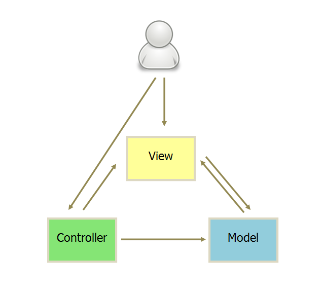

# MVC，MVP 和 MVVM 的图示

## MVC

-   视图（View）：用户界面。
-   控制器（Controller）：业务逻辑
-   模型（Model）：数据保存

各部分之间的通信方式如下。

-   View 传送指令到 Controlle
-   Controller 完成业务逻辑后，要求 Model 改变状态
-   Model 将新的数据发送到 View，用户得到反馈

所有通信都是单向的。

## 互动模式

接受用户指令时，MVC 可以分成两种方式。一种是通过 View 接受指令，传递给 Controller。

另一种是直接通过 controller 接受指令。

## 实例：Backbone

实际项目往往采用更灵活的方式，以 [Backbone.js]() 为例。

-   用户可以向 View 发送指令（DOM 事件），再由 View 直接要求 Model 改变状态。
-   用户也可以直接向 Controller 发送指令（改变 URL 触发 hashChange 事件），再由 Controller 发送给 View。
-   Controller 非常薄，只起到路由的作用，而 View 非常厚，业务逻辑都部署在 View。所以，Backbone 索性取消了 Controller，只保留一个 Router（路由器） 。

## MVP

MVP 模式将 Controller 改名为 Presenter，同时改变了通信方向。

-   各部分之间的通信，都是双向的。
-   View 与 Model 不发生联系，都通过 Presenter 传递。
-   View 非常薄，不部署任何业务逻辑，称为"被动视图"（Passive View），即没有任何主动性，而 Presenter 非常厚，所有逻辑都部署在那里。

## MVVM

MVVM 模式将 Presenter 改名为 ViewModel，基本上与 MVP 模式完全一致。

唯一的区别是，它采用双向绑定（data-binding）：View 的变动，自动反映在 ViewModel，反之亦然。Angular 和 Ember 都采用这种模式。
